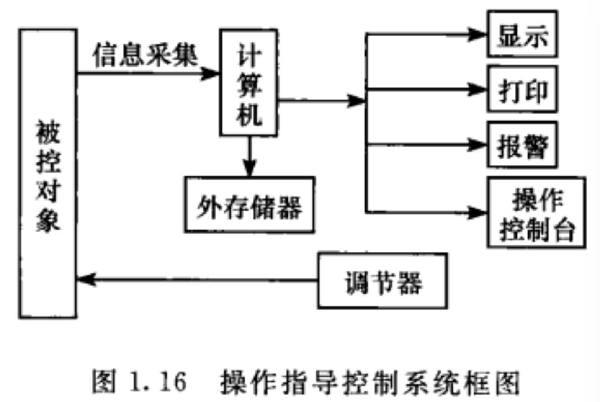
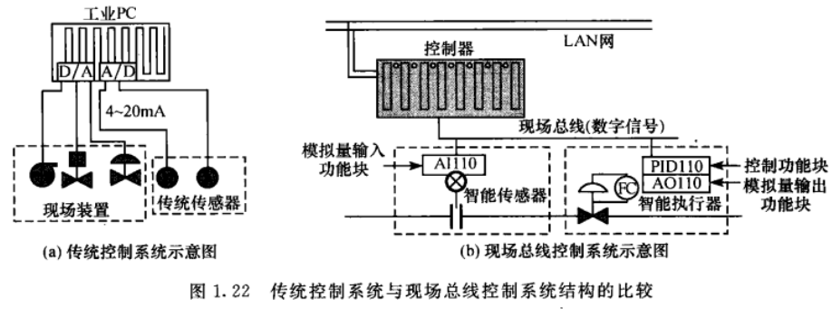

## 1.1 什么是计算机控制系统，比较模拟系统有什么优点？
由计算机参与并作为核心环节的自动控制系统称为计算机控制系统。
### 优点：
1. 设计和控制灵活。数字控制器的控制算法是通过编程实现的，所以很容易实现多种控制算法，修改控制算法的参数也比较方便。还可以通过软件的标准化和模块化，反复、多次调用这些软件
2. 能实现集中监视和操作。由于计算机有分时操作的功能，可以把生产过程的各个被控对象都管理起来，组成一个统一的控制系统，便于集中监视，集中操作管理。
3. 能实现综合控制。不仅能胜任常规控制规律，由于计算机的存储、逻辑判断功能，它可以综合生产各方面的情况，在环节与参数变化时，能及时进行判断、选择最合适的方案进行控制，必要时能通过人机接口进行人工干预。
4. 可靠性高，抗干扰能力强。在计算机控制系统中，可以利用程序进行故障自诊断、自修复功能，使计算机控制系统具有较强的可维护性。同时，存储于计算机系统中的控制程序也不易受外界干扰。
## 1.2 计算机控制系统的组成和作用。
1. 过程装置。包括被控对象、执行机构和测量变送装置。
2. 输入输出通道。包括过程通道和总线接口。
3. 计算机系统。包括计算机设备和外部设备。外部设备包括人机联系设备和通用外部设备。
## 1.3 基于权电阻的D/A转换器的工作过程。

对输入数字量中的每一位，按照权值分别转换为模拟量，然后通过运算放大器求和，得到响应的模拟量输出。对于无符号整数形式的二进制码，$n$位D/A转换器件的输出电压遵守如下：
$$V_{out}=V_{FSR}(\frac{B_1}{2^1}+\frac{B_2}{2^2}+\frac{B_3}{2^3}+...+\frac{B_n}{2^n})$$
$$V_{FSR}\rightarrow输出的满幅值电压$$
$$B_1\rightarrow二进制最高有效位$$
$$B_n\rightarrow二进制最低有效位$$
## 1.4 D/A转换器误差的来源主要是什么。
D/A转换器的误差主要由转换器转换精度（转换器字长）和保持器（采样点之间插值）的形式及规定的间隔时间$T$决定。
## 1.5 逐次逼近式ADC的工作过程。

类似于天平称重。当计算机发出转换命令并清除$n$位寄存器后，从最高位开始向低位置1，若某位置位后比较结果大于输入值，则置回0，否则保留，直到寄存器的最低一位为止。整个过程完成后，发出转换结束命令。这时寄存器里的内容就是输入模拟电压对应的数字量。
## 1.6 双积分ADC的工作过程。

转换方法是进行两次积分：一次是在固定时间$T$输入模拟电压$V_g$向电容充电；另一次是在已知参考电压$V_{REF}$下放电，放电所需时间与固定时间之比就等于参考电压和模拟电压的输入之比。
## 1.7 AD转换器的主要误差来源。
采样保持器S/H对连续的模拟输入信号按一定的时间间隔$T$进行采样，变成时间离散、幅值等于采样时刻输入信号值的序列信号。这个从连续时间信号变成离散时间信号的过程是A/D转换中最本质的变换。AD转换的主要误差由AD转换器转换速率（孔径时间）和转换精度（量化误差）来决定。
## 1.8 操作指导控制系统的结构和特点。

这类系统不仅提供现场情况和进行异常报警，而且还按照预先建立的数学模型和控制算法进行运算和处理，将最优的设定值打印和显示出来，操作人员根据计算机给出的操作指导，根据经验，由人直接改变调节器的给定值或操作执行机构。
当对生产过程的数学模型了解得不够彻底时，采用这种方法能得到满意的结果，具有灵活、安全和可靠等特点；但它仍需要人工操作，控制速度会受影响，不能同时控制多个回路。
## 1.9 直接数字控制系统（DDC）的结构和特点。

这类控制系统是把计算机运算结果直接输出去控制生产过程，属于闭环系统，计算机对生产过程的各参量进行检测，根据规定的数学模型进行运算，然后发出控制信号，直接控制生产过程。
它不仅能完全取代模拟调节器，而且只要改变程序就可以实现其他复杂的控制规律。还能集中监督和控制，给操作人员带来了极大的方便，但DDC对计算机要求很高，否则会影响生产。
## 1.10  计算机监督控制系统的结构和特点。
计算机的输出直接改变模拟调节器或DDC的设定值。

计算机对生产过程的各参量进行检测，按工艺要求或数学模型算出各控制回路的设定值，然后直接送给各调节器以进行生产过程的调节。
优点是始终能使生产过程处于最有运行状态，与操作指导系统相比，不会因为手调设定值的方式不同而引起控制质量的差异。这种系统比较灵活和安全，一旦SCC发生故障，仍可由模拟调节器单独完成操作。缺点是仍然需要采用模拟调节器。

SCC计算机的输出直接改变DDC的设定值。一台SCC可以控制数个DDC计算机，一旦DDC发生故障，可以用SCC代替，确保生产正常进行。
## 1.11 分级控制系统的结构和特点。

这种系统由管理信息系统（MIS）、计算机监督控制（SCC）和直接数字控制（DDC）三级组成。
MIS级为管理级，管理相应的生产计划、生产调度和指挥SCC级计算机工作。MIS计算机要求计算量大，因此应选用大、中型计算机。
SCC级为分级控制的中间级，集中生产过程信息，对生产过程进行优化、实现自适应或最优控制等，指挥DDC，接收MIS指令并向MIS汇报。一般由中、小型机担任。
DDC就是下级，用于直接控制生产过程，多采用微型机。
## 1.12 DCS控制系统的结构和特点。

集散控制系统的设计思想是“危险分散”，将控制功能分散，将监控和操作功能高度集中。
集散型控制系统由以微型机为核心的过程控制单元（PCU）、高速数据通道（DHW）、操作人员接口单元（OIU）和监控计算机等几个主要部分组成。
## 1.13 FCS控制系统的结构和特点。

现场总线控制系统的体系结构主要表现在：现场通信网络、现场设备互联、控制功能分散、通信线供电、开放式互联网络等方面。
由于FCS底层产品都是带有CPU的智能单元，FCS突破了传统DCS底层产品$4\sim 20 mA$模拟信号的传输。智能单元靠近临场设备，可以分别独立地完成测量、校正、调整、诊断和控制的功能。现场总线协议将它们连接在一起，任何一个单元出现故障都不会影响到其他单元，更不会影响全局，实现了彻底地分散控制，使系统更安全、更可靠。
## 1.14 NCS控制系统结构和特点。

以太网控制网络最典型的应用形式为顶层采用Ethernet，网络层和传输层采用国际标准TCP/IP。嵌入式控制器、智能现场测控仪表和传感器可以很方便地接入以太控制网。使多年形成的软、硬件资源和技术透明优势得以伸展，避免了现场总线技术游离于计算机网络技术之外。
