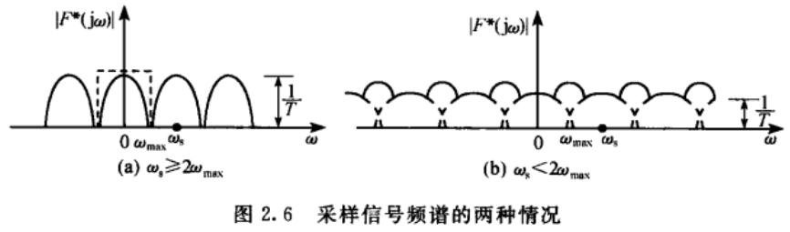
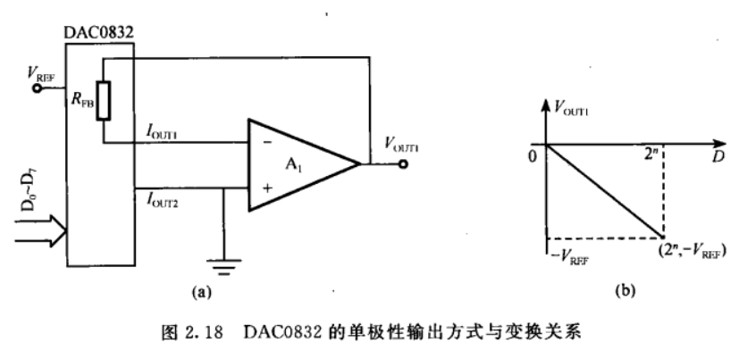
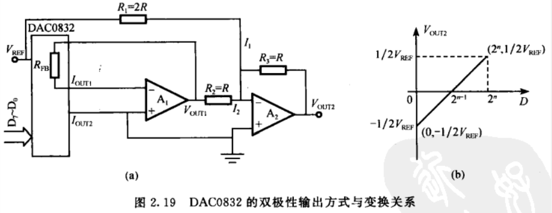
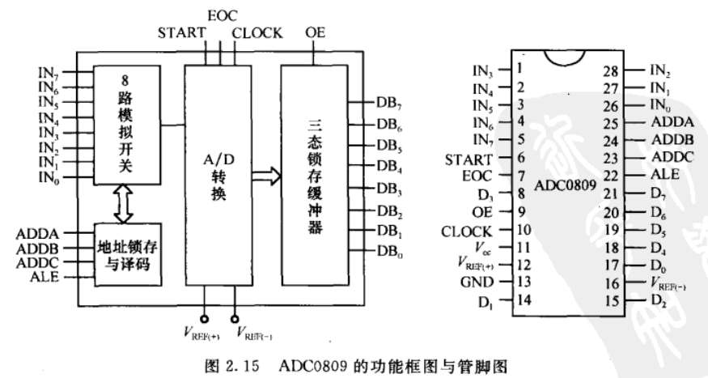

## 2.1 频率混叠现象。

采样信号各频谱分量的互相混叠，称为频谱混叠现象。
理想采样信号在以下两种情况下会发生频率混叠：
1. 当连续信号的频谱带宽有限时，即 $\omega<w_{max}$ 时，如果此时采样频谱太低（如 $\omega_s<2\omega_{max}$ ），则采样信号的各个周期分量将会相互交叠。
2. 连续信号的频谱是无限带宽，此时无论怎样提高采样频率，频谱混叠或多或少都会发生。
## 2.2 简述香农采样定理。
如果一个连续信号不包含高于频率 $\omega_{max}$ 的频率分量，那么完全可以用周期 $T<\pi/\omega_{max}$ 的均匀采样值来描述。或者说，如果采样频率 $\omega_s>2\omega_{max}$，那么就可以从采样信号中不失真地恢复原连续信号。
香农采样定理给出了采样周期的上限。
## 2.3 DA转换器有哪些主要芯片。字长如何选择。
常用8位DA转换芯片DAC0832。
对于DA转换器字长的选择，可以由计算机控制系统中DA转换器后面的执行机构的动态范围来选定。设执行机构的最大输入为 $u_{max}$ ，执行机构的死区电压为 $u_R$，DA转换器字长为 $n$ ，则计算机控制系统的最小输出单位应小于执行机构的死区，即：
$$\frac{u_{max}}{2^n-1}\le u_R$$
所以
$$n\ge \lg(u_{max}/u_R+1)/\lg2$$
## 2.4 DA输出通道的实现方式。

运算放大器起反相比例求和的作用，可以实现DA单极性输出。此时，$V_{OUT1}$、 $V_{REF}$、 $D_7\sims D_0 (D)$ 的关系为：
$$V_{OUT1}=-V_{REF}D/2^n$$

$V_{REF}$ 经电阻 $R_1$ 向运算放大器 $A_2$ 提供一个偏流 $I_1$ ，其电流与 $I_2$ 相反，正好使运算放大器 $A_2$ 的输出在运算放大器 $A_1$ 的基础上向上偏移 $0.5V_{REF}$。此时，$V_{OUT2}$ 、 $V_{REF}$ 、 $D_7\sims D_0 (D)$ 的关系为：
$$V_{OUT2}=-(\frac{R_3}{R_1}V_{REF}+\frac{R_3}{R_2}V_{OUT1})=\frac{1}{2}V_{REF}(\frac{D}{2^{n-1}}-1)$$
## 2.5 AD转换器有哪些主要芯片。字长如何选择。
8位8通道AD转换芯片ADC0809、12位逐次逼近式AD转换芯片AD574A。根据输入模拟信号的动态范围可以选择AD转换器的位数。设AD转换器的位数为 $n$ ，模拟输入信号的最大值 $u_{max}$ 为AD转换器的满刻度，则模拟输入信号的最小值 $u_{min}$ 应大于或等于AD转换器的最低有效位。即有：
$$\frac{u_{max}}{2^n-1}\le u_{min}$$
所以
$$n\ge \lg(u_{max}/u_{min}+1)/\lg2$$
## 2.6 AD转换器输入通道的实现方式。

AD输入信号可以有单极性和双极性两种形式。通过对参考电压的不同连接，可以构成不同的模拟量输入电路。AD转换器的输入电压 $V_{in}$ ，位数 $n$ ，参考电压 $V_{REF(+)}$ ， $V_{REF(-)}$ 的关系为：
$$D=\frac{V_{in}-V_{REF(-)}}{V_{REF(+)}-V_{REF(-)}}\times 2^n$$
## 2.7 AD转换时间的含义及其与AD转换速率和位数的关系。
设AD转换器已经处于就绪的状态，从AD转换的启动信号加入时起，到获得数字输出信号为止所需的时间称为AD转换时间，该时间的倒数称为AD转换速率。AD转换速率与AD的位数有关，一般来说，AD的位数越大，则相应的转换速率就越慢。
## 2.8 写出 $f(t)$ 的 $z$ 变换的多种表达方式。
$$Z[f(t)]=Z[f^*(t)]=F(z)=\sum_{k=0}^{\inf}f(kT)z_{-k}$$
## 2.9 证明下列关系
### (1) $Z[a^k]=\frac{1}{1-az_{-1}}$
$$Z[a^k]=F(z)=\sum_{k=0}^{\infty}a^kz^{-k}=\sum_{k=0}^{\infty}(az^{-1})^k=\frac{1-(az^{-1})^{\infty}}{1-az^{-1}}=\frac{1}{1-az^{-1}}$$
### (2) $Z[a^kf(t)]=f(\frac{z}{a})$
$$Z[a^kf(t)]=\sum_{k=0}^{\infty}a^kf(t)z^{-k}=\sum_{k=0}^{\infty}f(t)(\frac{z}{a})^{-k}\stackrel{变量代换}{\longrightarrow}F(\frac{z}{a})$$
